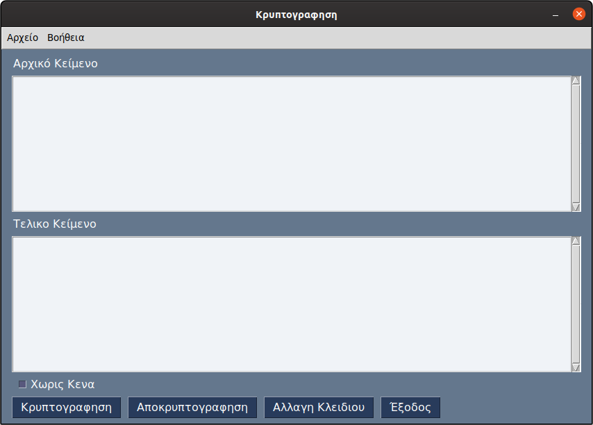

# Vigenere_Ecryption
A simple text encryption program writen in Python 3 using the [Vigenere Cipher](https://en.wikipedia.org/wiki/Vigen%C3%A8re_cipher) 
**Curenty only Greek Letters are supported**

[Download executable file](Encryption.exe)
